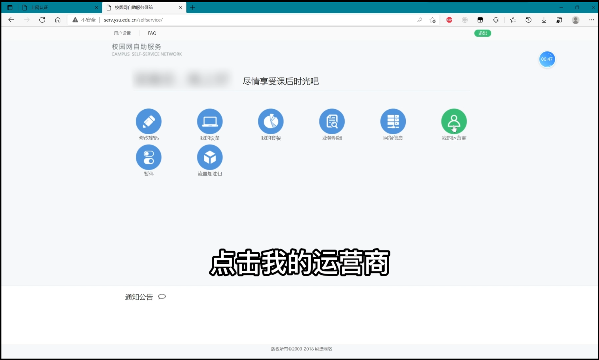

# 连接与认证方式

## 如何第一次连接校园网宽带

### 设置路由器
请在左侧菜单中设置路由器一项中找到你所使用的路由器，并按照教程设置

### 连接路由器
将手机或电脑连接至已设置好的路由器

### 进入认证页面
一般情况，手机在连接路由器后会自动跳出认证界面，电脑连接后打开浏览器也会自动跳出认证界面。
如果没有跳出认证界面，请打开手机和电脑自带的浏览器，在网址栏中输入`10.11.0.1`

### 进入自助服务
点击右上角自助服务

### 登录个人账号
进入自助服务页面后，在账号一栏输入自己的学号，密码为教务系统登录密码（默认为：身份证后六位+ysu）输入验证码，点击登录。

### 绑定运营商
登录后点击我的运营商，在弹出界面中填写运营商所给的宽带账号和密码，点击绑定并点击确认。（如果不知道账号密码就去找给你办校园卡的人）

### 登录校园网
打开手机和电脑自带的浏览器，在网址栏中输入`10.11.0.1`。在账号一栏输入自己的学号，密码为教务系统登录密码（默认为：身份证后六位+ysu），选择自己校园卡的运营商，点击“连接 login”。（如果没有反应请多刷新几次页面）弹出下方图片所显示的页面即连接成功，可以关掉页面并开始上网。

---

## 第一次过后再次连接校园网

参考上述步骤 `登录校园网` 。

## 连接教学楼内校园网

### 1. 连接教学楼内wifi

一般名为 `iYanda`。

### 进入认证界面
一般情况，手机在连接路由器后会自动跳出认证界面，电脑连接后打开浏览器也会自动跳出认证界面。
如果没有跳出认证界面，请打开手机和电脑自带的浏览器，在网址栏中输入`10.11.0.1`

### 登录校园网
在账号一栏输入自己的学号，密码为教务系统登录密码（默认为：身份证后六位+ysu），点击“连接 login”。
弹出下方图片所显示的页面即连接成功，可以关掉页面并开始上网。

