**注意：若此路由器并非首次使用或二手路由器，请长按Reset复位按键10秒左右，使TP-Link路由器恢复出厂设置。**

# 一.配置路由器

## 1.连接电源

连接电源后，等待30秒左右使路由器开机。（注意：此时请不要插入网线。)

## 2.路由器初始设置

### （1）连接未配置的路由器

    在路由器的底部标贴上查看路由器出厂的无线信号名称。

    打开手机或电脑的无线设置，连接路由器出厂的无线信号。

手机端：

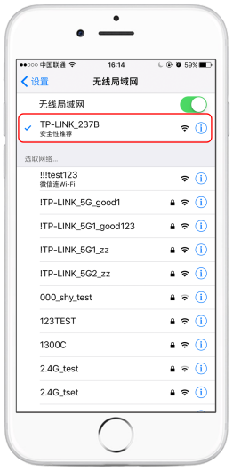

电脑端：

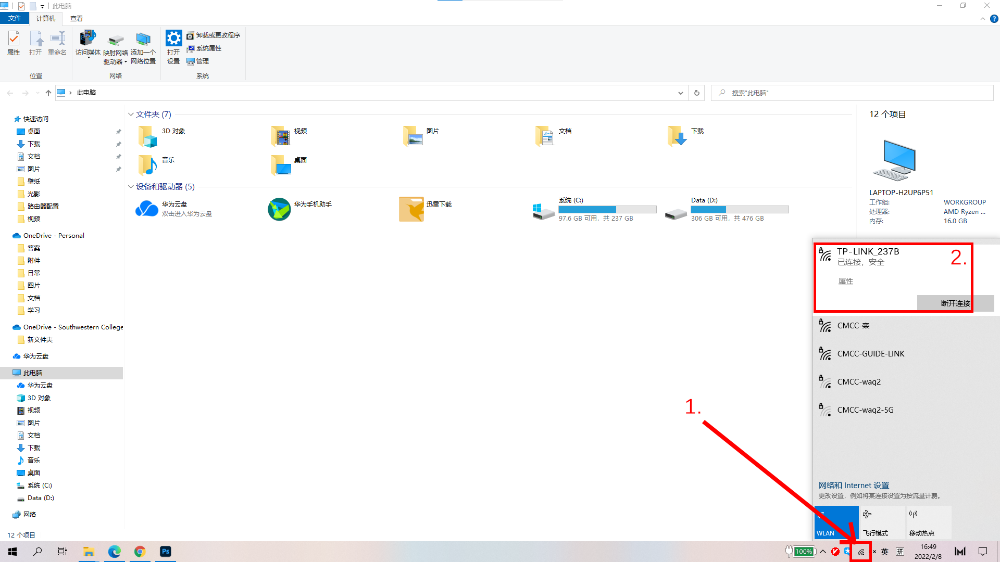

### （2）进入路由器初始设置页面

    连接Wi-Fi后，手机或电脑会自动弹出路由器的设置页面。若未自动弹出；请打开浏览器，在地址栏输入tplogin.cn。在该窗口中设置路由器的管理员登录密码（密码长度在6-32位区间），该密码用于以后管理路由器（登录界面），请妥善保管。如下图：

手机端：

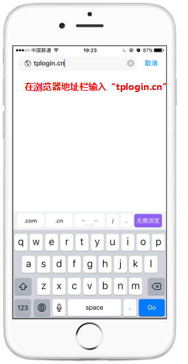

电脑端：

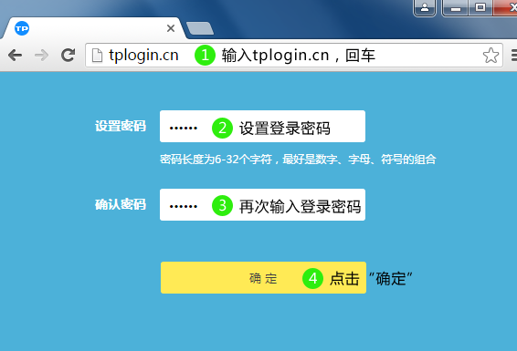

    登录成功后，路由器会自动检测上网方式。若上网方式检测为“自动获取IP上网”，则直接点击下一步，无需更改上网方式，若是其他选项，请手动更改上网方式为“自动获取IP上网”后，再点击下一步。

手机端：

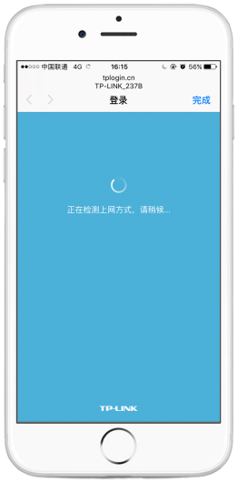
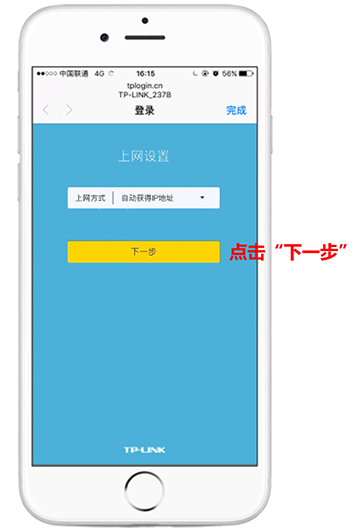

电脑端：

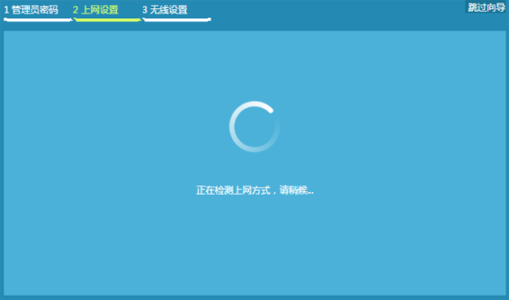

    设置路由器的无线名称和无线密码，设置完成后，点击“完成”保存配置。请一定记住路由器的无线名称和无线密码，在后续连接路由器无线时需要用到。
(注意：无线名称建议设置为字母或数字，尽量不要使用中文、特殊字符，避免部分无线客户端不支持中文或特殊字符而导致搜索不到或无法连接。)

手机端：

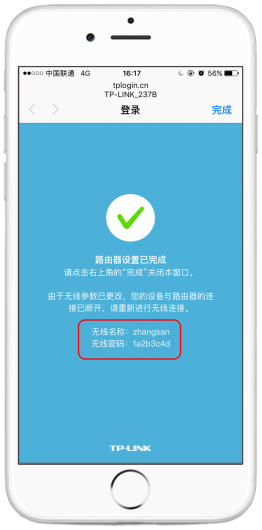

电脑端：

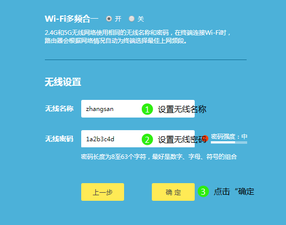

## 3.初始设置完成

    设置完成后，重新连接设置好后的无线名称，并输入无线密码，重新连接无线WiFi。

# 二.关闭DHCP功能

注：为防止上网异常，每部上网设备的IP将由学校统一分配，无需使用DHCP功能。

    再次打开浏览器，在浏览器地址栏再次输入tplogin.cn。在弹出的窗口中输入之前设置好的路由器管理员登录密码，进入路由器管理页面。
(注意：部分型号的路由器管理界面并没有为手机做专门的适配，若您无法看见完整的控制界面，请尝试在该页面使用双指控制页面缩放。)

手机端：

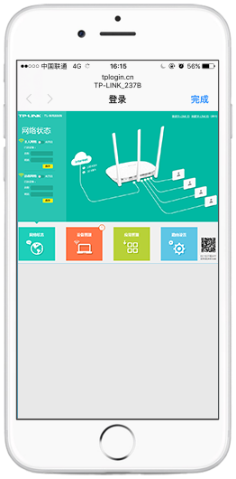

电脑端：

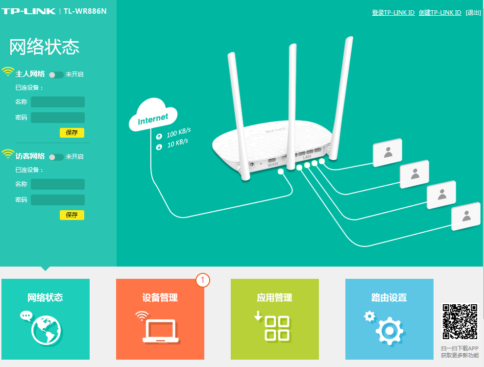

点击**路由设置** > **DHCP服务器**，在**DHCP服务器**选项处选择关，并保存。

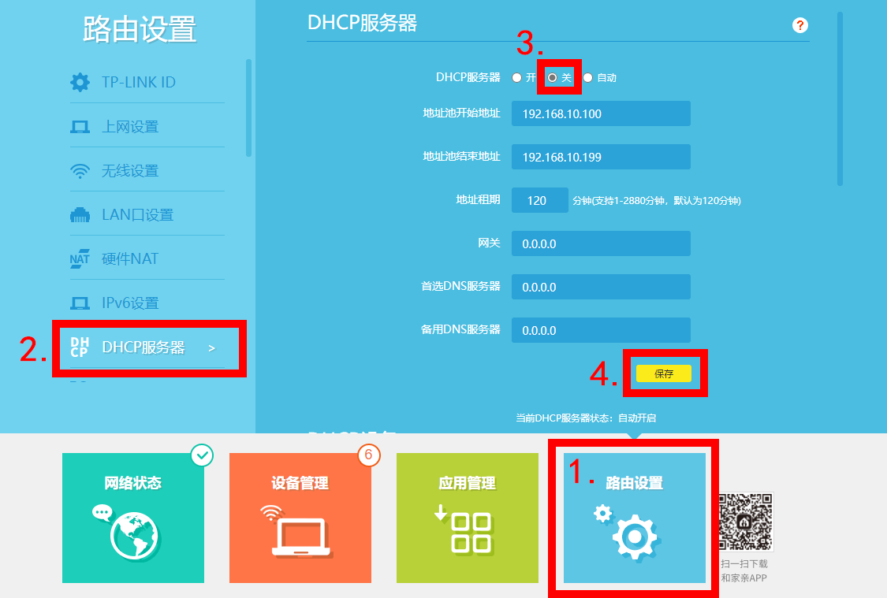

将网线的一端插在墙壁网口上，另一端网线插在路由器的“LAN”口上，待其网线插口附近的指示灯开始亮起，则说明路由器配置完成。

(注意：墙上的网口并不只有一个，部分宿舍两侧墙壁均有墙上网口，当插好后无法正常进行校园网认证上网，请换一个墙上网口再次尝试。若所有墙上网口均无法使用，请联系[信息技术中心](http://yit.ysu.edu.cn/)或运营商的专业人士)

# 三.连接手机或电脑，开始上网

以上步骤全部完成后，将路由器重启（断电再接通），手机或电脑重新连接路由器的WiFi信号，进行校园网认证，就可以上网冲浪了。校园网认证及登录方式请在左侧菜单中查看**连接与认证方式**。
